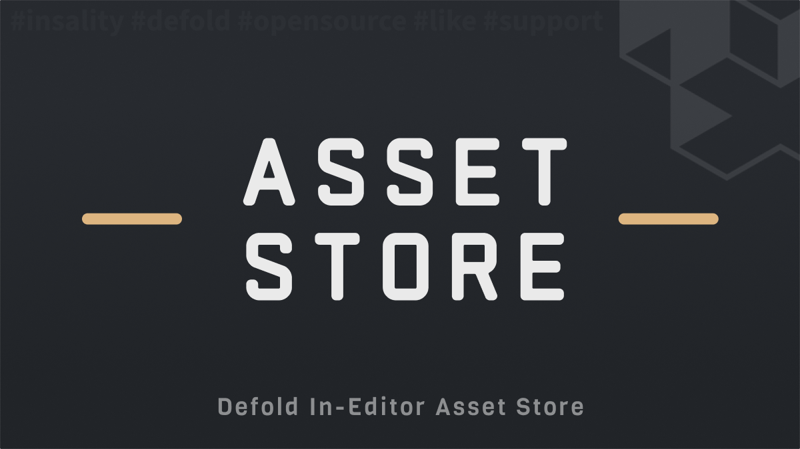

[](https://github.com/sponsors/insality) [](https://ko-fi.com/insality) [](https://www.buymeacoffee.com/insality)


# Asset Store

**Asset Store** - is an editor script for the [Defold](https://defold.com/) game engine. It provides a convenient way to browse, publish and install Defold dependencies and assets directly from the Defold editor interface.

## Features

- **Browse Dependencies**: View available Defold dependencies inside Defold Editor.
- **Search & Filter**: Search dependencies by title, author, description, or tags.
- **One-Click Installation**: Install dependencies directly into your project with automatic dependency resolution.
- **Community Driven**: You can contribute by easily adding your own dependencies to this repository or [Defold Asset Portal](https://defold.com/assets/) (they are automatically synced with this repository).

## Setup

### [Dependency](https://www.defold.com/manuals/libraries/)

Open your `game.project` file and add the following line to the dependencies field under the project section:

**[Asset Store](https://github.com/Insality/asset-store/archive/refs/tags/4.zip)**

```
https://github.com/Insality/asset-store/archive/refs/tags/4.zip
```

After that, select `Project ▸ Fetch Libraries` to update [library dependencies](https://defold.com/manuals/libraries/#setting-up-library-dependencies). This happens automatically whenever you open a project so you will only need to do this if the dependencies change without re-opening the project.

The Asset Store editor script will be automatically available in the Defold editor menu under `Project ▸ [Asset Store] Dependencies`.

## Usage

### Basic Usage

After installing the dependency, the Asset Store will appear in your Defold editor menu:

1. Open Defold Editor
2. Go to `Project` menu
3. Select `[Asset Store] Dependencies` to open the Dependency Store
4. Select `[Asset Store] Assets` to open the Asset Store
5. Browse, search, and install dependencies or assets


### Store

- [Dependencies](/dependencies_store.md) - Browse and install Defold dependencies
- [Druid Widgets](/druid_widget_store.md) - Browse and install Druid widgets
- [Editor Scripts](/assets_editor_scripts_store.md) - Browse and install Editor scripts
- [Lua Modules](/lua_modules_store.md) - Browse and install Lua modules
- [Particles](/particles_store.md) - Browse and install Particles
- [Materials](/materials_store.md) - Browse and install Materials


### Publishing Dependencies

Submit your library to the [Defold Asset Portal](https://defold.com/assets/). It will be synced to this repository and appear in the Dependencies store. See [dependencies_store.md](dependencies_store.md) for details (e.g. adding an API link).


### Publishing Assets

Add your asset in this repo under the right folder (`widget/`, `editor_scripts/`, `core/`, `particles/`, or `materials/`) and add a JSON manifest. Same manifest format for all; see [folder_assets_publishing.md](folder_assets_publishing.md) for the structure. Each store doc above has the exact path for that store.


## License

This project is licensed under the MIT License - see the LICENSE file for details.


## Issues and suggestions

If you have any issues, questions or suggestions please [create an issue](https://github.com/Insality/asset-store/issues).


## 👏 Contributors

<a href="https://github.com/Insality/asset-store/graphs/contributors">
  
</a>


## Changelog
<details>

### **V1**
- Initial release!

### **V2**
- Added Asset Store section in the editor menu
- Added support for images in editor scripts

### **V3**
- [#4] InvalidPathException: Illegal Character in ZIP filename
- Author button now sets the author filter to the selected author
- Add Asset Store settings window for various adjustments
- Keep tracking of last open filter between All/Installed/Not Installed options
- Default type filter search is now "All" for new users

### **V4**
- Require Defold 1.13.1 or later
- Fetch libraries via native editor API
- Asset Store windows are now resizable
- Version files setting is now disabled by default

</details>


## ❤️ Support project ❤️

Love what I'm building for **Defold**? Your support means the world to me! Consider buying me a coffee or a eclair - it helps me keep creating awesome tools for the community.

[](https://github.com/sponsors/insality) [](https://ko-fi.com/insality) [](https://www.buymeacoffee.com/insality)

